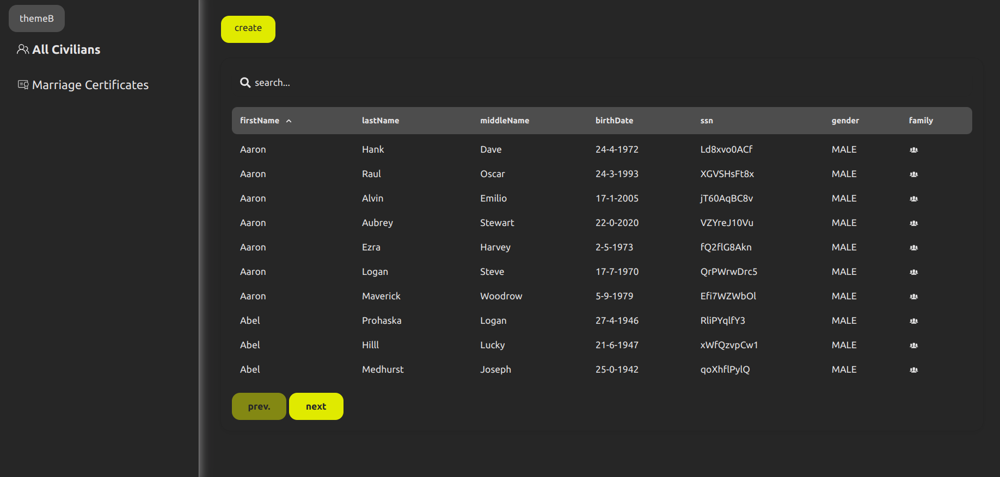
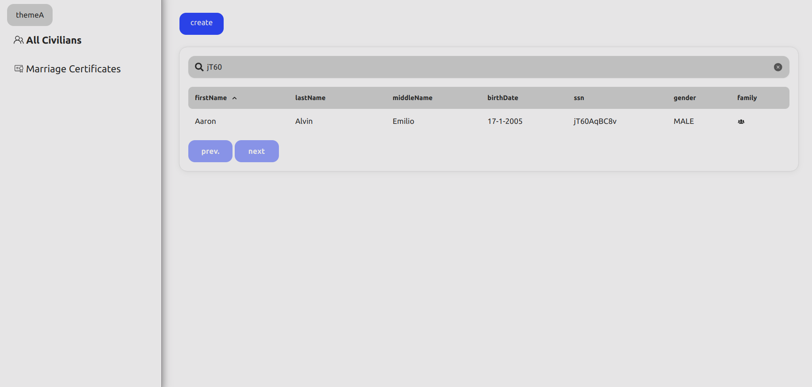
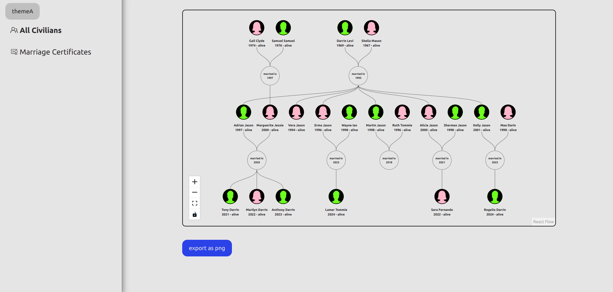
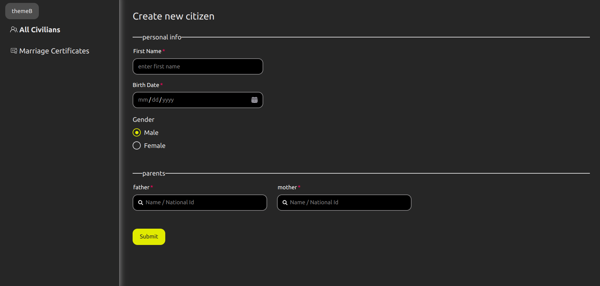

# civilians app 
this app is for educational purposes developped in NextJs and GraphQl, it connects to a fake DB representing fake population data 

## features available
1. displaying all existing people in the database (cursor based pagination)
2. ability to search for someone by his/her data
3. ability to insert new person
4. swithcing between different themes

> project is still under development

## problems

    1- Auth flow

    normally we login through calling nestjs App directly
    and get in return access token + refresh token 

    both AT & RT will be stored in browser

        ---------------------------------- 
        |     calls              calls   V
    client   ----->    Next App ---- > Nest Js

    problem is when the access token expires, then how to
    regenerate another one if I don't have the refresh token
    because the refresh token is supposed to be only sent alongside
    the refresh request.

    (there is always a need to send additional piece of data to the next app)
    
    sol 1
        wrap AT + RT in a cookie, and this cookie is to be sent alongside
        each request to the frontend server / api server.

        the cookies will be shipped with all requests and indeed we can't use
        the auth header because when refreshing the token at the frontend server amid some request, we will need to send the response of the request to the browser + the new access token which can only be done through cookeis.

        cons:
        - refresh token is being sent each time which defeats the purpose 
          of the refresh token.

    sol 2
        don't generate a refresh token, but keep a sessionId in the backend to
        track the user session and to allow him to generate new tokens.

        sessionID will be sent alongside each request to the NextApp server, but will 
        be sent to the api only during refreshing the access token

        cons:
        - if database is hacked, it will be a serious problem 

2- store UUID in bin format with sequelize

3- next js calls internally links to prepare them, this may disrupt 
   any kind of flows that you meant to execute once like refreshing your access token

    to get over it, you can set prefetch={false} on every Next Link component
## screen shots

#### listing all civilians

#### seach for a specific person

#### display family tree for a civilian

#### creating a new civilian

